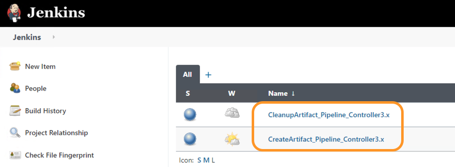
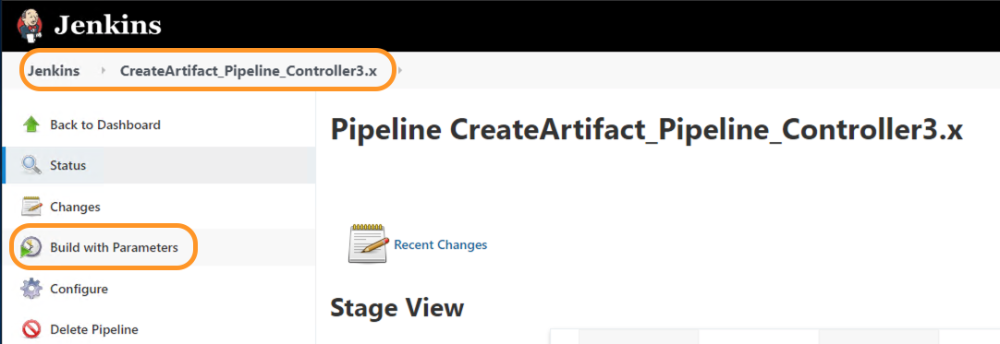
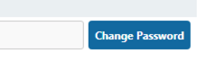
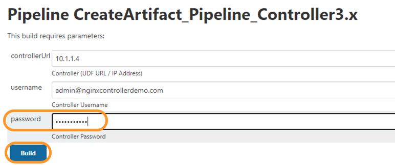
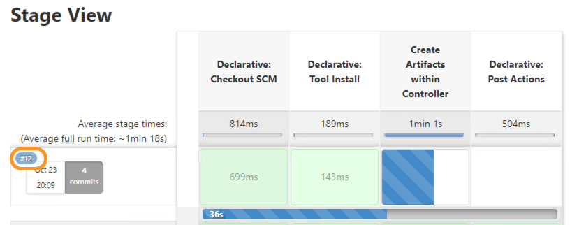
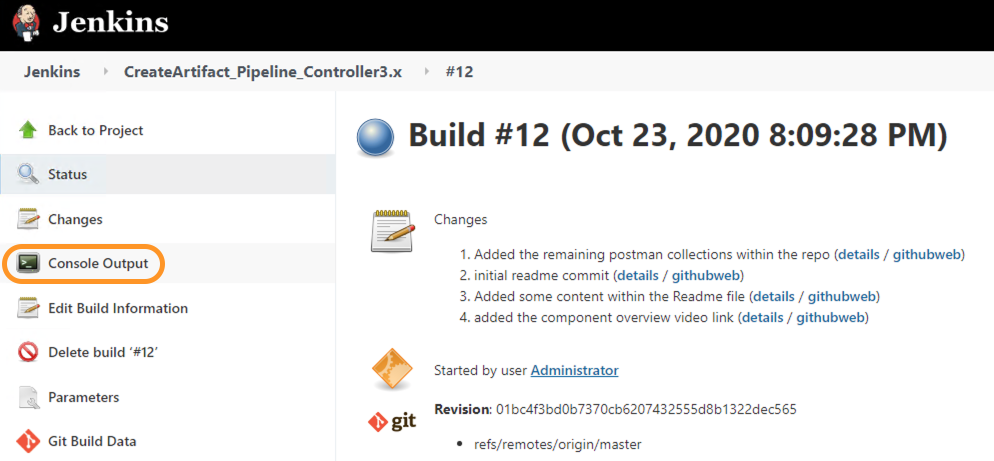
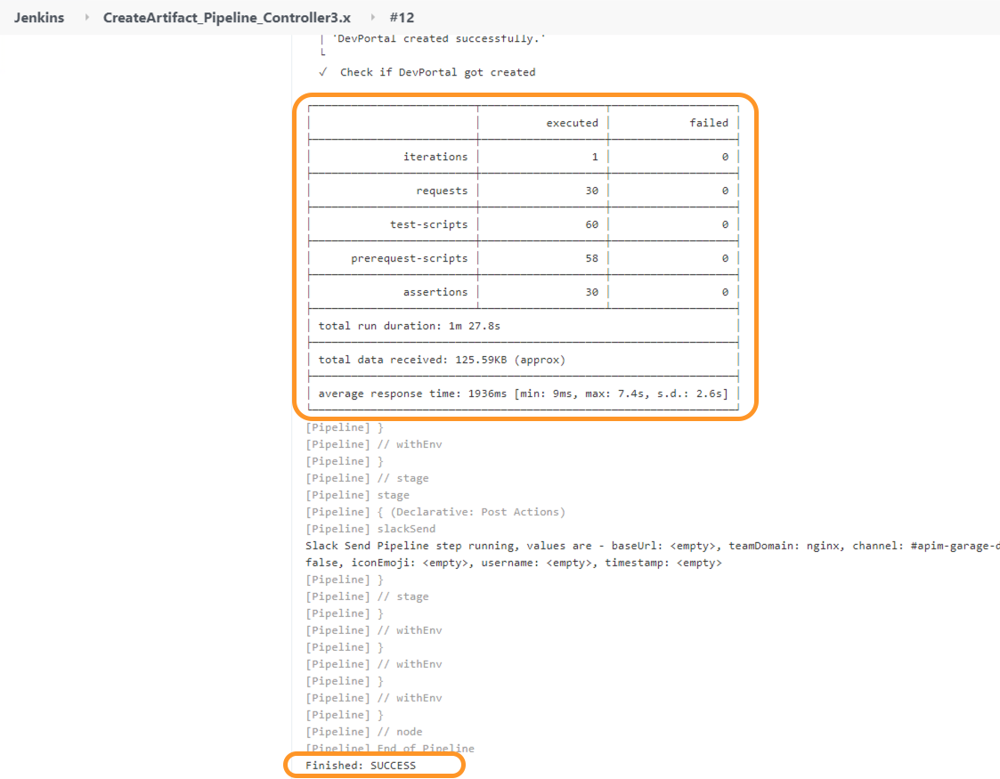
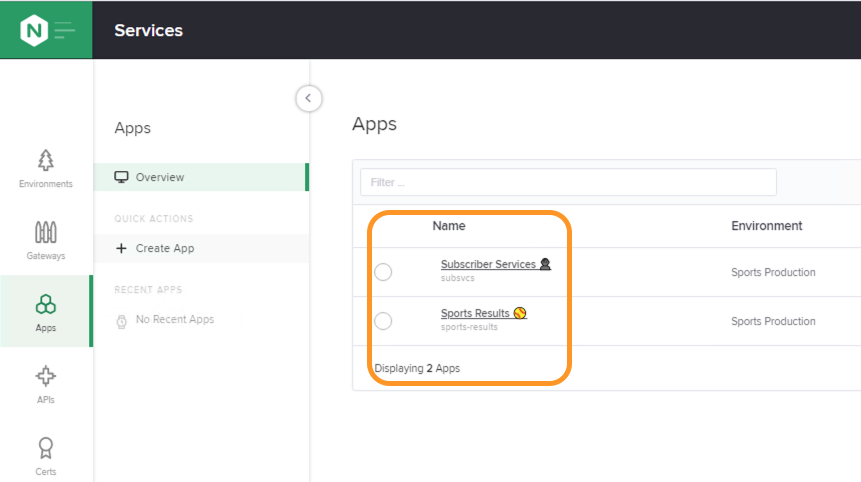

## APIM Automation/Publish Demo
- Login to Controller using Admin credentials. (For credentials, refer [README.md](../README.md) file)

- Navigate to `Services` view within Controller by clicking on the top right NGINX button.

- Make sure none of the components have been created.

- Now in another tab, within Google Chrome, login to Jenkins using Admin credentials. (For credentials, refer [README.md](../README.md) file)

- Within Jenkins you should be able to see two pipeline jobs as below.
  

- Open the `CreateArtifact_Pipeline_Controller3.x` job, by clicking on it. 

- Within the job detail page, click on `Build with Parameter` from the left pane.
  

- Clicking on `Build with Parameter` will open the job parameter options page.
  
- For our UDF, all the default values should work except the password. To update the default password click on the `Change Password` button on the right most side of password field. 
  

- Once you have updated the Controller admin password click on the `Build` button.
  

- Once the `Build` button is pressed, you would be navigated back to the main page for the job and you should be able to see a job running as below. Clicking on the `Job number` (highlighted in the diagram) opens the job details page.
  

- Within the job's detail page, click on `Console Output` to get detailed logs of the job run.
  

- Scrolling all the way till the end we notice the job finished with `Success` and also get some useful stats as highlighted in below screenshot.
  

- If we navigate back to Controller we can see all the components have been created and are ready to be used.
  