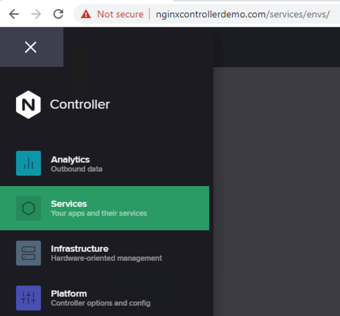
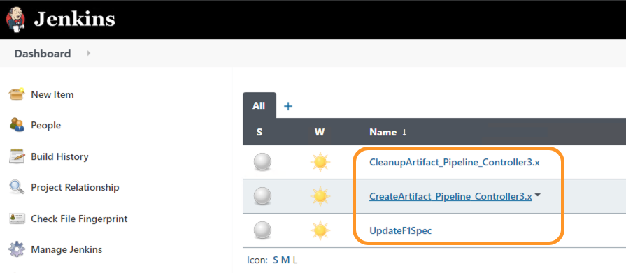
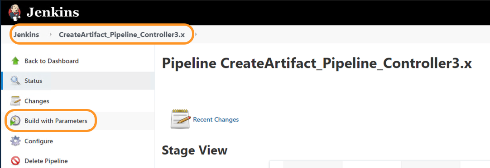
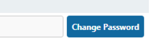
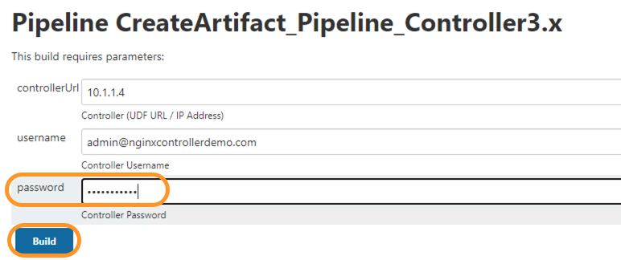
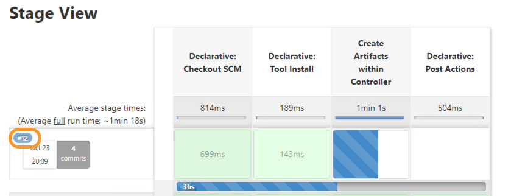
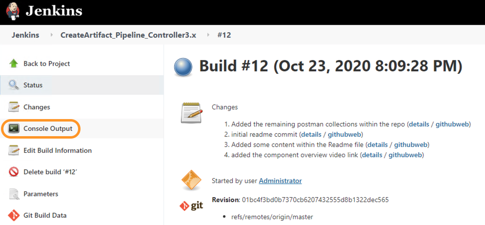
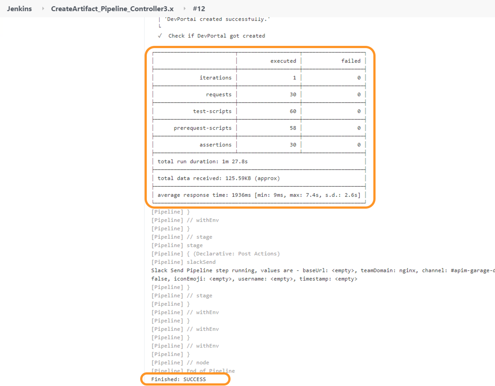
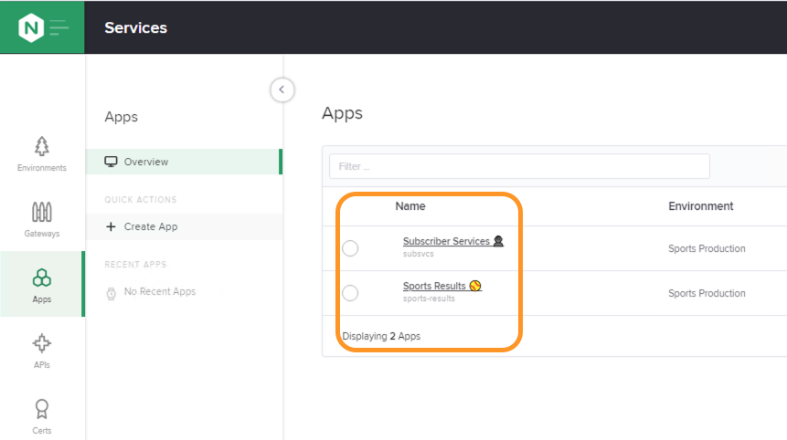
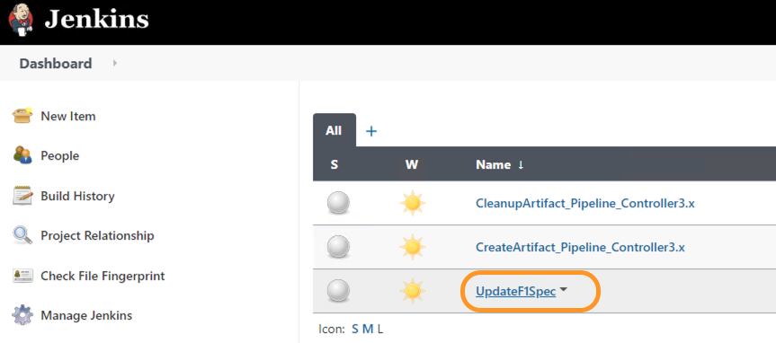

## APIM Automation/Publish Demo
- On the Jumphost, open up `Google Chrome`.

- Select the bookmark toolbar link: (`Controller|Login`) https://nginxcontrollerdemo.com 

- Login to Controller using Admin credentials. (For credentials, refer [README.md](../README.md#demo-environment-related-credentials) file)

- Navigate to `Services` view within Controller by clicking on the top right NGINX button. 

- Make sure none of the components have been created.

- Now in another tab, within Google Chrome, Select the bookmark toolbar link: (`Jenkins|Login`) http://10.1.1.10:8080/
  
- Login to Jenkins using Admin credentials. (For credentials, refer [README.md](../README.md#demo-environment-related-credentials) file)

- Within Jenkins you should be able to see three pipeline jobs as below. 
  

- Open the `CreateArtifact_Pipeline_Controller3.x` job, by clicking on it. 

- Within the job detail page, click on `Build with Parameter` from the left pane. 
  

- Clicking on `Build with Parameter` will open the job parameter options page.
  
- For our UDF, all the default values should work except the password. To update the default password click on the `Change Password` button on the right most side of password field. 
  

- Once you have updated the Controller admin password click on the `Build` button. 
  

- Once the `Build` button is pressed, you would be navigated back to the main page for the job and you should be able to see a job running as below. Clicking on the `Job number` (highlighted in the diagram) opens the job details page. 
  

- Within the job's detail page, click on `Console Output` to get detailed logs of the job run. 
  

- Scrolling all the way till the end we notice the job finished with `Success` and also get some useful stats as highlighted in below screenshot. 
  

- If we navigate back to Controller we can see all the components have been created and are ready to be used. 
  

- To deploy a newer version of F1 API (Version 2 API Spec) run `UpdateF1Spec` job within jenkins in a similar fashion as you ran the `CreateArtifact_Pipeline_Controller3.x` job. 
  