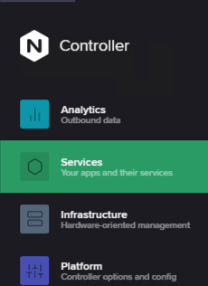

## APIM Blue/Green Demo

- On the Jumphost, open `Postman` app from the desktop and then expand `4_NGINX Controller Dev API` collection.
- Within this collection open `Create_Dev_F1_V1_Component` request and add `weight` field to each `uris` within the request body payload as shown in below screenshot. Click on `Send` to run the request.<br>


  - **NOTE:** In case the above request provides a `401 Unauthorized` response as below then you need to run the `Login Admin` request first to generate an authentication token for subsequent calls.<br>
  
  

- If the `Create_Dev_F1_V1_Component` request succeeds then you should receive a `202 Accepted` response code as shown in below screenshot.<br>


- On the Jumphost, open `Visual Studio Code` app and then connect to Terminal `10.1.1.7` using SSH client.

- Run the following commands to generate load
  ```bash
  for i in {1..500}; do curl  http://devsports.example.com/api/f1/drivers; done
  ```
  ```bash
  for i in {1..500}; do curl  http://devsports.example.com/api/f1/seasons; done
  ```

- Navigate to `Services` view within Controller by clicking on the top right NGINX button.<br>


- Select `Apps` from left pane and then click on `Dev Sports Results` app.<br>
  

- Within the `Dev Sports Results` app page, click on `Go to Analytics` button.<br>
  

- Inside the Analytics window, set the time window to `Last 15 minutes` and set `Breakout By:` to `HTTP Upstream Addr`.<br>


- Refresh your browser to display the graphs:
  - Specifically look at the `HTTP Requests` graph.
  - You should see a graph that represents an upstream load ratio between the two nodes as follows:<br>
 

- Now we would swap the `weights` of our backend servers. To do so, go back to `Postman` app and then open up the `4_NGINX Controller Dev API` collection.
  
- Within this collection open `Create_Dev_F1_V1_Component` request and swap the values in the `weight` field within the request body payload as shown in below screenshot. Click on `Send` to run the request.<br>


- Run the following commands to generate load within the terminal of `Visual Studio Code`.
  ```bash
  for i in {1..500}; do curl  http://devsports.example.com/api/f1/drivers; done
  ```
  ```bash
  for i in {1..500}; do curl  http://devsports.example.com/api/f1/seasons; done
  ```

- Navigate back to `Services` view within Controller by clicking on the top right NGINX button.<br>


- Select `Apps` from left pane and then click on `Dev Sports Results` app.<br>
  

- Within the `Dev Sports Results` app page, click on `Go to Analytics` button.<br>
  

- Inside the Analytics window, set the time window to `Last 15 minutes` and set `Breakout By:` to `HTTP Upstream Addr`.<br>


- Refresh your browser to display the graphs:
  - Specifically look at the `HTTP Requests` graph.
  - You should see a graph that represents the inverse of the load ratio that you saw with the last payload configuration, or an `X` pattern, thereby representing a Blue/Green scenario to the upstreams.<br>
  
  
  - Below screenshot depicts the formation of an `X` pattern.<br>
  