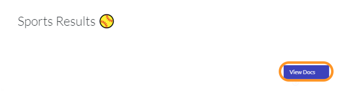
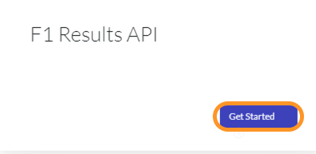
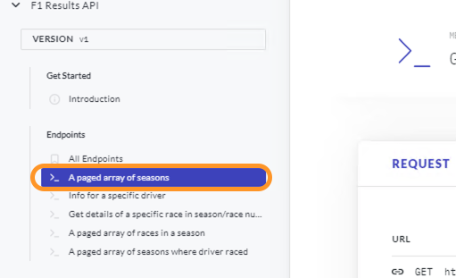
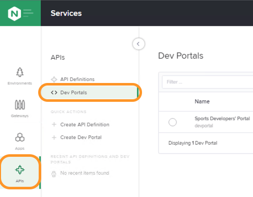
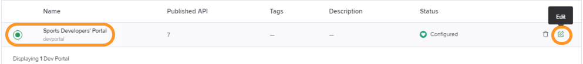
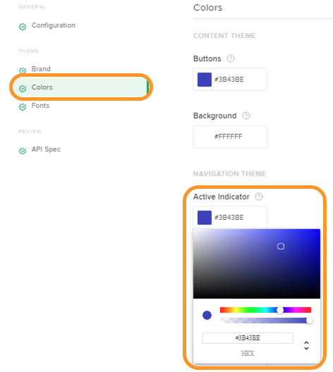
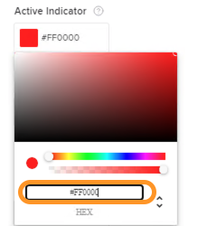
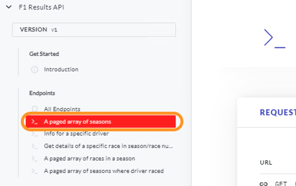

## APIM Developer Portal Demo
- On the Jumphost, open up `Google Chrome`.

- Select the bookmark toolbar link: (`Sports DevPortal`) https://devportal.example.com 

- Login to Controller using Admin credentials. (For credentials, refer [README.md](../README.md#demo-environment-related-credentials) file)

- Select `Sports Results` and then click on `View Docs` button.
  

- Select `F1 Results API` and then click on `Get Started` button.  
  

- Demonstrate/browse the published content and review the API definitions and details.

- Note the (`Active Indicator`) color of the left side browser frame which is blue.
  

- Login to Controller using Admin credentials. (For credentials, refer [README.md](../README.md#demo-environment-related-credentials) file)

- Navigate to `Services` view within Controller by clicking on the top right NGINX button.
 

- Select `APIs` and then select `Dev Portals`  
  

- Select `Sports Developers' Portal` and then click on the `Edit` button
   

- Briefly browse the page and show the Dev Portals various style configuration capabilities. 

- Select `Colors` and then select `Active Indicator` which would open a color palette as shown in below screenshot.
  

- Change the HEX value from `#3B43BE` to `#FF0000` which is the HEX code for red and then click on `Submit` on top right corner of the screen to save the changes. 
  
  
- Return to the http://devportal.example.com webpage and reload it. 

- Note the highlight color changed to `Red` which we selected as the `Active Indicator`.
  

- The ability to customize your Dev Portal is a standard feature in NGINX Controller.