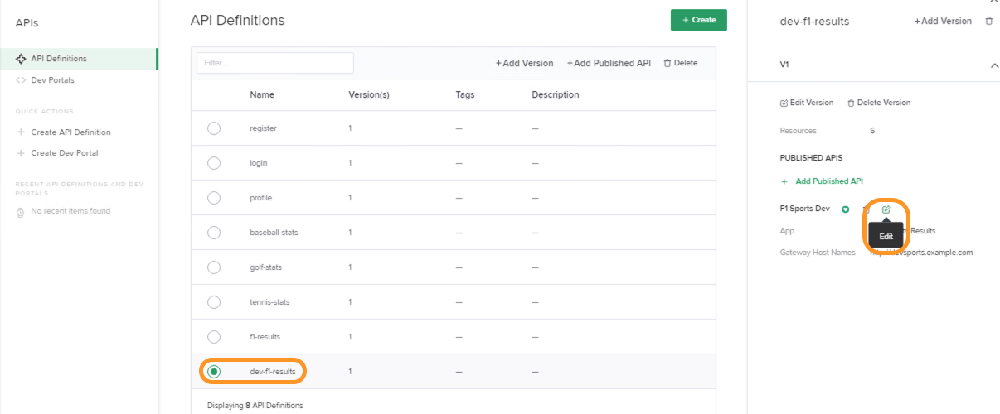

# APIM Security Demo / API Key / Rate Limiting

- On the Jumphost, open `Postman` app from the desktop and then run `5_Controller3.x_API_Key_Creation` collection.
  - Click on `Run` by selecting the collection.<br> 
  
  - Select the `Environment` as `Controller3.x Env` and then click on the `Run` button as shown in below screenshot.<br>
    

- Now open up `Google Chrome`.

- Select the bookmark toolbar link: (`Controller|Login`) https://nginxcontrollerdemo.com 

- Login to Controller using Admin credentials. (For credentials, refer [README.md](../README.md#demo-environment-related-credentials) file)

- Navigate to `Services` view within Controller by clicking on the top right NGINX button.<br>


- Select `APIs`.<br> 
  

- Select `dev-f1-results` and then click on `Edit` button within the `Published APIS` portion on right hand pane as shown in below screenshot.<br>
  

- Inside the `Edit Published API` pane, select `Routing` tab and then click on `Edit` for the menu item currently labeled as `No Security Settings` as shown in the screenshot.<br>
  

- Inside the `Edit App Component` pane, select `Authentication` tab and then click `Add Authentication` as shown in the screenshot.<br>
  

- Select `Test Client API keys` for `Identity Provider` field. Select `Header` for `Credential Location` field and enter `apikey` for the `Credential Value` field. Click on `Done` to save your selections.


- Now within the `Edit App Component` pane, select `Rate Limiting` tab and then enable rate limiting using the `toggle` button. Fill out the Rate limiting form with below details
  - Key: `Client IP Address`
  - Rate: `1`
  - Units: `Requests per second`
  - Excess Request Processing: `Reject immediately`
  - Reject Status Code: `429`
  
  

- Click on `Submit` button at both `Edit App Component` and `Edit Published API` panes to apply Authentication and Rate limiting to the published API.

- Now we would look into how we can  **test** the newly configured Authentication and Rate Limiting features.

- On the Jumphost, open `Visual Studio Code` app and then connect to Terminal `10.1.1.7` using SSH client.

- Run the following commands and check the outputs of those commands.
    - **Scenario 1:** No Key provided
        ```bash
        for i in {1..10}; do curl http://devsports.example.com/api/f1/drivers; done
        ```
        **Observation:** response expected `401(1 request)`, `429(9 request)`

    - **Scenario 2:** Authorize using valid API key
        ```bash
        for i in {1..10}; do curl -H "apikey: f958ce3a-7934-4b76-80f9-38bd3a14e722" http://devsports.example.com/api/f1/drivers; done
        ```
        **Observation:** response expected `200(1 request)`, `429(9 request)`

    - **Scenario 3:** Authorize using invalid API key
        ```bash
        for i in {1..10}; do curl -H "apikey: f958ce3a-7934-4b76-80f9-38bd3a14e722x" http://devsports.example.com/api/f1/drivers; done
        ```
        **Observation:** response expected `403(1 request)`, `429(9 request)`
  
- This concludes this demo. Return to the NGINX controller and `DELETE` the Authentication and `Disable` Rate Limit for `dev-f1-results` component as shown in below screenshots.
    - Delete Authentication<br>
    

    - Disable Rate Limiting<br>
    

- Finally save the changes by clicking on `Submit` at both `Edit App Component` and `Edit Published API` panes.