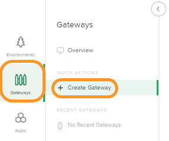

## APIM User/Group - Gateway Isolation

- On the Jumphost, open up `Google Chrome`.

- Select the bookmark toolbar link: (`Controller|Login`) https://nginxcontrollerdemo.com 

- Login to Controller using Admin credentials. (For credentials, refer [README.md](../README.md#demo-environment-related-credentials) file)

- Navigate to `Platform` view within Controller by clicking on the top right NGINX button. 

- Create a `Role` by selecting the `Roles` icon from left pane and then clicking on `Create Role`. 

- Within the `Create Role` pane, navigate to the bottom of the page and select `CREATE NEW ENVIRONMENT`. 

- In the `Create Environment` pane, enter the name `dev-f1` and then click on submit. This would create a new environment with `dev-f1` name.

- Once the new Environment has been created, enter `devrole` in role Name field, and at the bottom for permissions section, grant appropriate access as shown in the screenshot below. Once done click on `Create` button to create the new role. 

- Next we will create a user, to create a user select the `Users` icon on left pane and then click on `Create User` button. 

- Within the `Create User` pane, fill out the details as below screenshot. Once done click on `Create` button to create the new user.
  

- Navigate to `Services` view within Controller by clicking on the top right NGINX button. 

- Now we would create a new gateway. Navigate to `Gateways` icon and then click on `Create Gateway` button. 

- Within the `Create Gateway` pane, fill out the fields as below:
  - In `Configuration` tab, fill `Name` and `Environment` section as shown in the screenshot. 
  
  - In `Placements` tab, fill `Instance Refs` section as shown in the screenshot. 
  
  - In `Hostnames` tab, select `Add Hostname` and then fill `Hostname(URI Formatted)` section as shown in the screenshot. 
  
  - Finally, select `Submit` to create the new gateway.
  
- Now we would create a new app. Navigate to `Apps` icon and then click on `Create App` button. 

- Within the `Create App` pane, fill out the details as below screenshot. Once done click on `Submit` button to create the new app.

- Open `Postman` app from the desktop and then run `4_NGINX Controller Dev API` collection.
  - Click on `Run` by selecting the collection. 
  
  - Select the `Environment` as `Controller3.x Env` and then click on the `Run` button as shown in below screenshot.
    

- Log out of NGINX Controller as `admin` 
  

- Log back into NGINX controller as `dev` user using below credentials
  - Username: `dev@example.com`
  - Password: `Admin123!@#` 

- Navigate to `Services` view within Controller by clicking on the top right NGINX button. 

- Select `Environments`, `Gateways` and `Apps` sequentially. 

- **NOTE:** You can only view the components that are defined in your role and environment. Also, the placement for the gateway is limited to `apigateway3`.

- Select `APIs`.  
  

- **Note:** You can only view API definition, published APIs and components for `dev-f1-results` based on your role access.

- Logout of NGINX Controller as `dev` user. 
