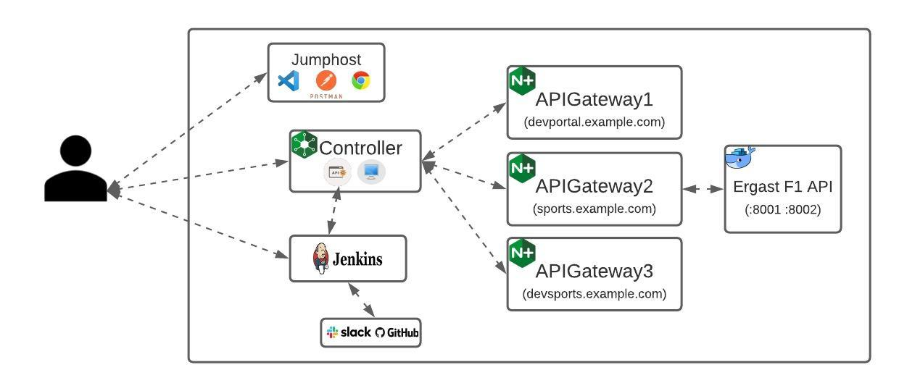

# Controller APIM Demo

## Getting started with Demo in UDF 

- Log into UDF
- Navigate to `Blueprints` tab on left bar. Search for `NGINX Controller APIM Demos`([Link](https://udf.f5.com/d/58a21db7-b545-4c1c-96fd-81f82133ea44#documentation)) within the search bar.
- Once found click on `Deploy`. This step will add the blueprint within your deployments.
- Navigate to `Deployments` tab on left bar. This will show all your deployments in the right pane. Select `NGINX Controller APIM Demos` and click on `START`.
- Once your deployment has started, click on `Details`. This opens up your `NGINX Controller APIM Demos` deployment page.
- In this page click on the `Components` tab which would display all the running instances within this deployment.
- Go to `jumphost windows 2019 > Access > RDP` This would download a `.rdp` file in your local system. We will use this file to login to the jumphost.
- Open `.rdp` file in any of your preferred rdp client application.
- Use below credentials for connecting to RDP
  - Username: `Administrator`
  - Password: `SJ5rD7bFA`
- Within Jumphost we would be using "Google Chrome", "Postman" and "Visual Studio Code". Shortcuts for each of this apps can be found on the desktop.
 
## UDF Demo Environment Architecture:
